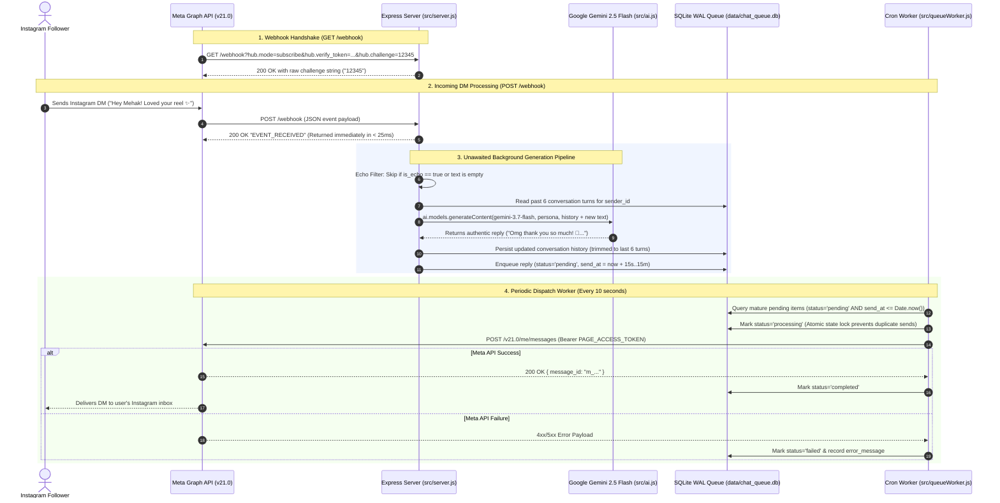

# Mehak Instagram DM Automation System

A production-ready, resilient Node.js backend application designed to automate Instagram Direct Messages using the official **Meta Graph API (v21.0)**, the official **Google Gemini API (`@google/genai`)**, and a persistent **SQLite Write-Ahead Logging (WAL) message queue**.

Built to power the **"Mehak Dave"** persona: born in 2000, Mumbai-based Gujarati entrepreneur and owner of 'Triven Hub' (digital app development & e-commerce integrations). Sharp, independent, multitasking, texting entirely in lowercase with Mumbai slang.

---

## 1. Architecture & End-to-End Data Flow

The system uses an asynchronous, decoupled architecture to guarantee sub-50ms webhook responses (preventing Meta webhook timeouts) while shielding the Instagram account from bot-detection flags with humanized reply delays:



---

## 2. Directory Structure

```text
├── data/
│   └── chat_queue.db        # SQLite database (WAL mode, tables: conversations, message_queue)
├── src/
│   ├── ai.js                # Gemini 3.7 Flash client & Mehak persona engine
│   ├── db.js                # SQLite WAL database connection & query functions
│   ├── queueWorker.js       # Cron scheduler (runs every 10s) & Meta dispatcher
│   └── server.js            # Express server (GET /webhook, POST /webhook, GET /health)
├── test/
│   ├── sample_payload.json  # Mock Instagram DM webhook payload for local testing
│   └── verify.js            # Automated verification test suite
├── .env.example             # Template for required environment variables
├── .env                     # Local configuration file (ignored by git)
├── .gitignore               # Git exclusions
├── package.json             # ES Module project configuration & scripts
└── README.md                # System documentation & handoff guide
```

---

## 3. Environment Configuration

The application requires 4 environment variables defined in `.env`:

| Variable | Required | Default | Description |
| :--- | :---: | :--- | :--- |
| `PORT` | No | `3000` | Port for the Express server to listen on. |
| `VERIFY_TOKEN` | **Yes** | `mehak_secret_verify_token` | Secret string you define. Must match the Verify Token entered in the Meta App Dashboard. |
| `PAGE_ACCESS_TOKEN` | **Yes** | — | Meta Graph API Page Access Token (with `instagram_manage_messages` and `pages_messaging` scopes). |
| `GEMINI_API_KEY` | **Yes** | — | API key from Google AI Studio to call `gemini-3.7-flash`. |

### Creating `.env`
Copy `.env.example` to `.env`:
```bash
cp .env.example .env
```
Open `.env` and fill in `GEMINI_API_KEY` and `PAGE_ACCESS_TOKEN`.

---

## 4. How to Run Locally

### Prerequisites
- Node.js >= 18.0.0 (Tested on Node.js v24.15)
- npm >= 9.0.0

### Step 1: Install Dependencies
```bash
npm install
```

### Step 2: Run Verification Test Suite
Run the built-in end-to-end test suite to verify SQLite tables, WAL mode, sliding window conversation trimming, webhook handshakes, and worker transitions:
```bash
npm test
```

### Step 3: Start the Application
- **Production Mode**:
  ```bash
  npm start
  ```
- **Development Mode** (auto-restarts on file changes):
  ```bash
  npm run dev
  ```

Once started, the server outputs:
```text
[QueueWorker] Initializing cron worker with schedule "*/10 * * * * *" (every 10 seconds)...
[Server] Mehak Instagram DM Automation server running on port 3000
[Server] Webhook URL: http://localhost:3000/webhook
[Server] Healthcheck: http://localhost:3000/health
```

### Step 4: Expose Server with ngrok
Because Meta Webhooks require a public HTTPS URL:
```bash
ngrok http 3000
```
Copy the Forwarding HTTPS URL provided by ngrok (e.g., `https://abc-123.ngrok-free.app`).

Your public Webhook URL will be:
```text
https://abc-123.ngrok-free.app/webhook
```

---

## 5. Meta Developer Portal Setup

Follow these steps to connect your Instagram Professional / Creator account to the webhook:

### 1. Facebook Developer App Configuration
1. Go to [developers.facebook.com](https://developers.facebook.com) and open your App.
2. Ensure you have added the **Instagram** and **Messenger / Webhooks** products.
3. Link your Instagram Professional / Creator Account to a Facebook Page.

### 2. Configure Webhook
1. In the Meta App Dashboard, navigate to **Webhooks** (or **Instagram > Basic Display / Messaging Webhooks**).
2. Select **Instagram** from the dropdown and click **Subscribe to this object**.
3. In **Callback URL**, paste your ngrok URL:
   ```text
   https://abc-123.ngrok-free.app/webhook
   ```
4. In **Verify Token**, enter the exact string configured in your `.env` (e.g., `mehak_secret_verify_token`).
5. Click **Verify and Save**. Meta will send a `GET /webhook` handshake request. The server will respond with `200` and return `hub.challenge`.

### 3. Subscribe to Webhook Fields
Under the subscribed Instagram object:
1. Find the **`messages`** field.
2. Click **Subscribe**.
3. (Optional) Also subscribe to `messaging_postbacks` if using quick replies.

### 4. Required Token Permissions
Ensure the `PAGE_ACCESS_TOKEN` has the following permissions granted:
- `instagram_basic`
- `instagram_manage_messages`
- `pages_show_list`
- `pages_read_engagement`

---

## 6. Local Terminal Testing Commands

Test your server locally without needing to wait for live Instagram DMs.

### A. Test GET /webhook (Verification Handshake)
Simulate Meta's verification challenge:
```bash
# Windows PowerShell / CMD / Bash:
curl -i "http://localhost:3000/webhook?hub.mode=subscribe&hub.verify_token=mehak_secret_verify_token&hub.challenge=test_challenge_code_999"
```
**Expected Response:**
```http
HTTP/1.1 200 OK
Content-Type: text/html; charset=utf-8

test_challenge_code_999
```

Test invalid token rejection (403 Forbidden):
```bash
curl -i "http://localhost:3000/webhook?hub.mode=subscribe&hub.verify_token=wrong_token&hub.challenge=test_challenge_code_999"
```

### B. Test POST /webhook (Mock DM Ingestion)
Send a mock Instagram DM event payload:

**Using the included test payload file:**
```bash
curl -i -X POST http://localhost:3000/webhook \
  -H "Content-Type: application/json" \
  --data-binary "@test/sample_payload.json"
```

**Using an inline JSON payload (Linux / macOS / Git Bash):**
```bash
curl -i -X POST http://localhost:3000/webhook \
  -H "Content-Type: application/json" \
  -d '{
    "object": "instagram",
    "entry": [{
      "id": "page_123",
      "time": 1725890000000,
      "messaging": [{
        "sender": { "id": "test_user_bandra" },
        "recipient": { "id": "page_123" },
        "timestamp": 1725890000000,
        "message": {
          "mid": "m_12345",
          "text": "Mehak! Which cafe were you at in Bandra yesterday? ✨"
        }
      }]
    }]
  }'
```

**Expected HTTP Response (< 30ms):**
```http
HTTP/1.1 200 OK
Content-Type: text/html; charset=utf-8

EVENT_RECEIVED
```

### C. Check Queue & System Health
Check active queue statistics:
```bash
curl -i http://localhost:3000/health
```
**Response:**
```json
{
  "status": "ok",
  "uptimeSeconds": 142,
  "timestamp": "2026-09-09T16:45:00.000Z",
  "queue": {
    "total": 12,
    "pending": 1,
    "processing": 0,
    "completed": 10,
    "failed": 1
  }
}
```

---

## 7. Database Persistence & Inspection

The SQLite database is stored at `data/chat_queue.db`.

### Schema Details

#### Table 1: `conversations`
Keeps a rolling sliding window of the last 6 turns per follower:
- `sender_id` (`TEXT PRIMARY KEY`): The follower's IGSID.
- `history` (`TEXT NOT NULL`): JSON array of `{ role: 'user' | 'model', text: string }`.
- `updated_at` (`INTEGER NOT NULL`): UNIX epoch millisecond timestamp.

#### Table 2: `message_queue`
Guarantees message delivery with status tracking and delay enforcement:
- `id` (`INTEGER PRIMARY KEY AUTOINCREMENT`): Unique message ID.
- `sender_id` (`TEXT NOT NULL`): Instagram recipient ID.
- `reply_text` (`TEXT NOT NULL`): AI-generated reply.
- `send_at` (`INTEGER NOT NULL`): Scheduled timestamp (epoch ms).
- `status` (`TEXT DEFAULT 'pending'`): Current state (`pending` -> `processing` -> `completed` | `failed`).
- `error_message` (`TEXT DEFAULT NULL`): Detailed error payload from Meta if dispatch fails.
- `created_at` (`INTEGER NOT NULL`): Timestamp when enqueued.

### How to Inspect SQLite Database
You can inspect the database directly using Node.js one-liners:

1. **View pending messages:**
   ```bash
   node -e "import('./src/db.js').then(({ db }) => { console.table(db.prepare('SELECT id, sender_id, reply_text, datetime(send_at/1000, \"unixepoch\") as send_time, status FROM message_queue WHERE status = \"pending\"').all()); db.close(); })"
   ```

2. **View conversation history for a user:**
   ```bash
   node -e "import('./src/db.js').then(({ getConversationHistory }) => { console.log(getConversationHistory('test_user_bandra')); })"
   ```

3. **View failed messages with Meta error logs:**
   ```bash
   node -e "import('./src/db.js').then(({ db }) => { console.table(db.prepare('SELECT id, sender_id, error_message FROM message_queue WHERE status = \"failed\"').all()); db.close(); })"
   ```

---

## 8. Continuation & Recovery Guide

If you or another developer/AI agent resumes development on this project, follow this checklist:

### A. If the Server or Machine Restarts
1. SQLite WAL mode ensures **zero data corruption**. Unsent messages remain safely stored with status `'pending'`.
2. As soon as the server boots up (`npm start`), the queue worker resumes its 10-second cron check. Any messages whose scheduled `send_at` time passed while the server was offline will be picked up on the very first tick and sent immediately.
3. Stuck `'processing'` messages: If a server crashed midway through sending, you can reset orphaned `'processing'` items back to `'pending'` with:
   ```bash
   node -e "import('./src/db.js').then(({ db }) => { db.prepare(\"UPDATE message_queue SET status = 'pending' WHERE status = 'processing'\").run(); console.log('Reset stuck processing messages.'); db.close(); })"
   ```

### B. Anti-Ban Safety Rules & Persona Continuity
1. **Random Delays**: The randomized delay between 15 seconds and 15 minutes (`MIN_DELAY_MS` to `MAX_DELAY_MS` in `src/server.js`) is essential to protect the Instagram account from automated rate-limiting. Do not reduce the minimum below 10 seconds for production traffic.
2. **Echo Loop Prevention**: Always ensure `item.message.is_echo === true` checks remain active in `src/server.js`. If removed, when the bot sends a reply, Meta sends an echo webhook event, creating an infinite AI loop.
3. **Persona Tuning**: If editing Mehak's persona prompt, update `MEHAK_SYSTEM_INSTRUCTION` in `src/ai.js`. Maintain the constraints against customer support phrases ("How can I help?") and boundaries on flirtatious messages.
